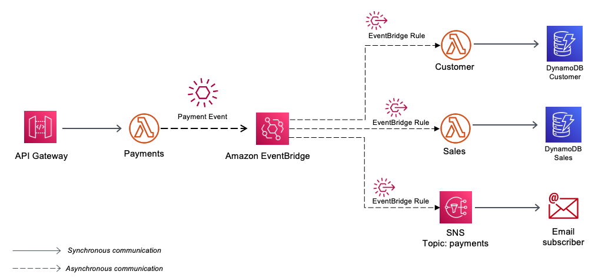

## Event-Driven Architecture - AWS Serverless - Java

This is a Java implementation of the EventBridge Publisher/Subscriber Pattern as described in the official AWS documentation
https://docs.aws.amazon.com/prescriptive-guidance/latest/modernization-integrating-microservices/pub-sub.html



## Description

The communication style in this pattern is asynchronous.

The Payments Lambda function sends three messages to the EventBridge, which has three rules with different Event Patterns.

The EventBridge will invoke a different Lambda function, depending on the Source and Detail-Type specified in the event request.

The Lambda functions will process the messages asynchronously and the first Lambda will not expect any response from the downstream processors.

The SAM template contains all the information to deploy AWS resources and also the permission required by these service to communicate.

You will be able to create and delete the CloudFormation stack using AWS SAM.

This is fully functional example implemented in Java 11.

Important: this application uses various AWS services and there are costs associated with these services after the Free Tier usage - please see the AWS Pricing page for details. You are responsible for any AWS costs incurred.

## Language:
#### This is a Maven project which uses Java 11 and AWS SDK

## Framework
The framework used to deploy the infrastructure is SAM

## Services used

#### API Gateway - AWS Lambda - EventBridge - DynamoDB - Amazon SNS

## Deployment commands

````
mvn clean package

# create an S3 bucket where the source code will be stored:
aws s3 mb s3://mpiud9283undqjdn23e89ed

# upload the source code to S3:
aws s3 cp target/sourceCode.zip s3://mpiud9283undqjdn23e89ed

# SAM will deploy the CloudFormation stack described in the template.yml file:
sam deploy --s3-bucket mpiud9283undqjdn23e89ed --stack-name event-driven-pattern --capabilities CAPABILITY_IAM

````

## Testing

```
# Subscribe to the SNS Topic to receive the confirmation email

# use aws cli to show the SNS Topics
aws sns list-topics

# subscribe to the SNS topic with your email address and confirm your subscription
aws sns subscribe \
    --topic-arn arn:aws:sns:eu-central-1:YOUR_AWS_ACCOUNT:Communication \
    --protocol email \
    --notification-endpoint YOUR_EMAIL@DOMAIN.com
    
# Copy the API Gateway URL for the Payments endpoint from the sam deploy outputs
#  i.e. 
# Outputs                                                                                                                                                                                                                             
# -------------------------------------------------------------------------------------------------------------------------------------------------------------------------------------------------------------------------------------
# Key                 PaymentsEndpoint                                                                                                                                                                                                      3
# Description         API Gateway Payments Endpoint                                                                                                                                                 
# Value               https://______________/prod/payments


# Call the API Gateway 

curl -X POST https://API_GATEWAY_URL -H "Content-Type: application/json" -d '{"customerId": "111-aaa","customerFullName":"John Smith","customerEmail": "john.smith@example.com","amount": "89.99","product": "car insurance"}' 

# you should receive an email with the information
# and also see in the console the confirmation message

# Scan the DynamoDB CustomerPayments 
aws dynamodb scan --table-name CustomerPayments

# Scan the DynamoDB Sales 
aws dynamodb scan --table-name Sales    
```

## Cleanup

Run the given command to delete the resources that were created. It might take some time for the CloudFormation stack to get deleted.
```
aws cloudformation delete-stack --stack-name event-driven-pattern

aws s3 rm s3://mpiud9283undqjdn23e89ed --recursive

aws s3 rb s3://mpiud9283undqjdn23e89ed
```

## Requirements

* [Create an AWS account](https://portal.aws.amazon.com/gp/aws/developer/registration/index.html) if you do not already have one and log in. The IAM user that you use must have sufficient permissions to make necessary AWS service calls and manage AWS resources.
* [AWS CLI](https://docs.aws.amazon.com/cli/latest/userguide/install-cliv2.html) installed and configured
* [AWS Serverless Application Model](https://docs.aws.amazon.com/serverless-application-model/latest/developerguide/serverless-sam-cli-install.html) (AWS SAM) installed


## Author
Razvan Minciuna
https://www.linkedin.com/in/razvanminciuna/